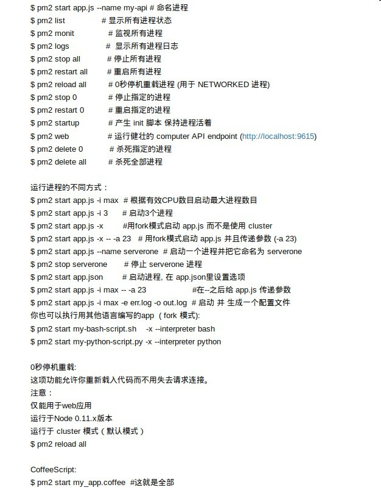
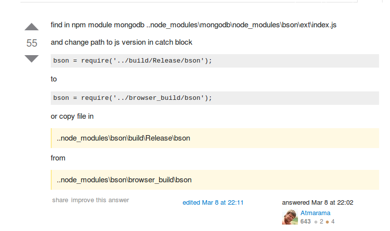

#阿里云服务器安装文档

##安装nodejs
> 1.下载Linux Binaries (.tar.gz)包，以node-v4.2.1-linux-x64.tar.gz为例；
> 2.将1中的文件解压，解压后文件夹名为node-v4.2.1-linux-x64，拷贝到/user/lib/node文件夹下；
> 3.配置/etc/profile文件，添加如下两行：
> ```
> export NODE_HOME=/usr/lib/node/node-v4.2.1-linux-x64
> export PATH=$NODE_HOME/bin:$PATH
> export NODE_PATH=$NODE_HOME/lib/node_modules
> ```
> 4.执行以下指令：
> ```
> source /etc/profile
> ```
> 5.检验是否安装成功：
> ```
> node -v
> ```

##安装mongodb
> 1.执行如下指令：
> ```
> apt-get install mongodb
> ```

##安装sails
> 1.执行如下指令：
> ```
> npm -g install sails --unsafe-perm
> ```

##安装bower
> 1.执行如下指令：
> ```
> npm install -g bower --unsafe-perm
> ```

##安装pm2
> 1.执行如下指令：
> ```
> npm install -g pm2 --unsafe-perm
> ```

##操作pm2
> 

##安装gulp
> 1.执行如下指令：
> ```
> npm -g install gulp --unsafe-perm
> ```

##安装redis
> 1.官网 http://redis.io/ 下载源码包；
> 2.解压，make编译；
> 3.使用apt安装redis-tools;

###操作redis
>详情参见以下三个文件：
>>1. redis.sh
>>```
>>#! /bin/bash
>>cd /opt/redis-3.0.5/src
>>dbFile="dump.rdb"
>>if [ -f "$dbFile" ] ; then
>>rm dump.rdb
>>fi
>>./redis-server
>>```
>>2. begin.sh
>>```
>>#! /bin/bash
>>nohup ./redis.sh&
>>exit
>>```
>>3. stop.sh
>>```
>>#! /bin/bash
>>redis-cli shutdown
>>cd /opt/redis-3.0.5/src
>>dbFile="dump.rdb"
>>if [ -f "$dbFile" ] ; then
>>rm dump.rdb
>>echo 'delete redis-db success.'
>>fi
>>```

#常见问题解决
>1.bower install --allow-root
>2.npm install   --unsafe-perm (root发生权限错误的时候)
>3.npm install bson
>